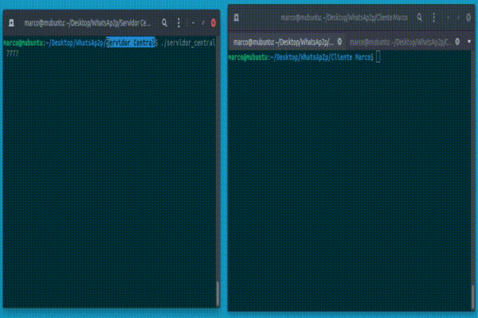
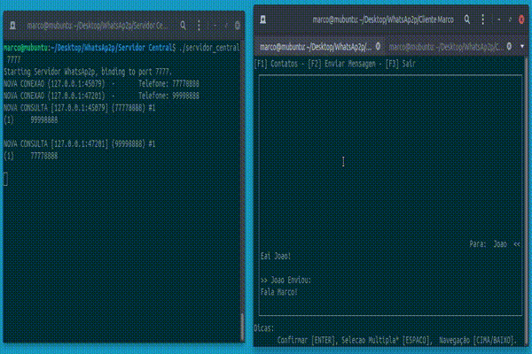
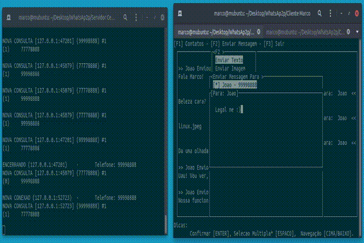

# WhatsAp2p
Computer Engineering class taken in 2020/1

* **Objetivo:** Obter conhecimentos básicos para o desenvolvimento de software peer-to-peer (P2P) em ambientes TCP/IP. Implementar um sistema de envio de mensagens de texto e foto peer-to-peer (WhatsAp2p) em linguagem C.

## Índice:
  - [Módulos](#módulos)
  - [Requisitos](#requisitos-do-projeto)
  - [Ambiente](#ambiente-de-desenvolvimento)
  - [Compilação](#processo-de-compilação)
  - [Demonstração](#demonstrações)


## Módulos
#### -  Servidor central
* O **servidor central** deverá permitir aos usuários localizar os demais usuários online. Cada usuário é identificado no servidor central por um **número de telefone** e sua localização corresponde ao **endereço IP** e à porta onde o módulo de usuário deste usuário aguardará por mensagens e fotos.
> 
#### - Módulo de usuário
* O **módulo de usuário** deverá permitir ao usuário enviar mensagens e fotos a outros usuários e também receber mensagens e fotos de outros usuários, a partir das informações de localização obtidas do **servidor central**.

## Requisitos do Projeto

O **módulo de usuário** inicia a conexão informando ao **servidor central**: um **número de telefone**, **IP** e **porta** em que aguardará por conexões para a troca de mensagens P2P.

O **servidor central** armazena então os dados de identificação registrando este usuário como online (chat disponível). Usuários não registrados no **servidor central** são identificados como **offline** (chat indisponível) e por consequência incapazes de receber mensagens e ou fotos.

O usuário deve ser capaz de adicionar um **contato e também criar grupos de contatos**, tais informações são armazenadas em um **arquivo local** e também pré carregadas na inicialização.

Ao solicitar cada envio de mensagem (texto ou foto) a um contato ou a um grupo, o **módulo de usuário** deve realizar uma **consulta ao servidor central** para obter a **disponibilidade** desse(s) contato(s) e, em seguida o conteúdo da **mensagem** deve ser enviado diretamente à localização do contato, sem passar pelo servidor central (P2P).

Quando um usuário finalizar o seu **módulo de usuário**, toda informação relativa à localização deste usuário deve ser removida do **servidor central** (o usuário fica indisponível na central). 

- O **servidor central** e os **módulos de usuário** devem suportar acesso concorrente.
- Deve ser possível executar mais de um **módulo de usuário** no mesmo computador.
- O endereço de IP e a porta do servidor central deverão ser passados como parâmetro para o **módulo de usuário** na linha de comando.

## Ambiente de Desenvolvimento

#### O projeto foi desenvolvido em ambiente linux (Ubuntu), para o processo de compilação é necessário instalar algumas dependências, segue instruções:

* A biblioteca ```"ncurses.h"``` deve ser instalada: ```$ sudo apt-get install libncurses5-dev libncursesw5-dev -y```

* Todas as demais dependências envolvendo a stdlib, make e o gcc também são pré-requisito para a compilação.

* A IDE utilizada no desenvolvimento do projeto foi o VSCode.

## Processo de Compilação

#### Para a compilação foi utilizado o gcc 9.3.0 e o GNU Make 4.2.1

```
$ make
gcc -o lib/contatos.o lib/contatos.c -c
gcc -o lib/regs.o lib/regs.c -c
gcc -o lib/ui.o lib/ui.c -lncurses -c 
gcc -o lib/messenger.o lib/messenger.c -c -Wimplicit-function-declaration
lib/messenger.c: In function ‘envia_msg’:
lib/messenger.c:126:5: warning: implicit declaration of function ‘close’; did you mean ‘pclose’? [-Wimplicit-function-declaration]
  126 |     close(externo);
      |     ^~~~~
      |     pclose
gcc -o modulo_usuario modulo_usuario.c lib/regs.o lib/contatos.o lib/ui.o lib/messenger.o -pthread -lncurses -Wimplicit-function-declaration
modulo_usuario.c: In function ‘thread_fn’:
modulo_usuario.c:415:5: warning: implicit declaration of function ‘close’; did you mean ‘pclose’? [-Wimplicit-function-declaration]
  415 |     close(ns);
      |     ^~~~~
      |     pclose
gcc -o servidor_central servidor_central.c lib/regs.o -pthread
```

##  Demonstrações

Parte 1



Parte 2



Parte 3


